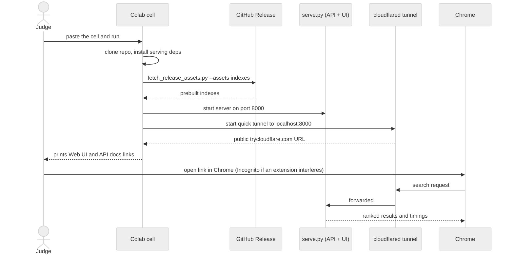
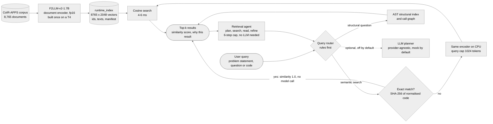
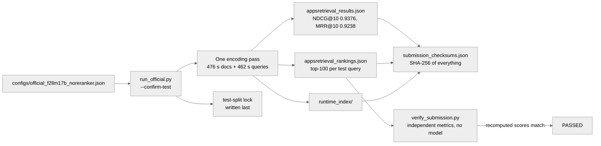
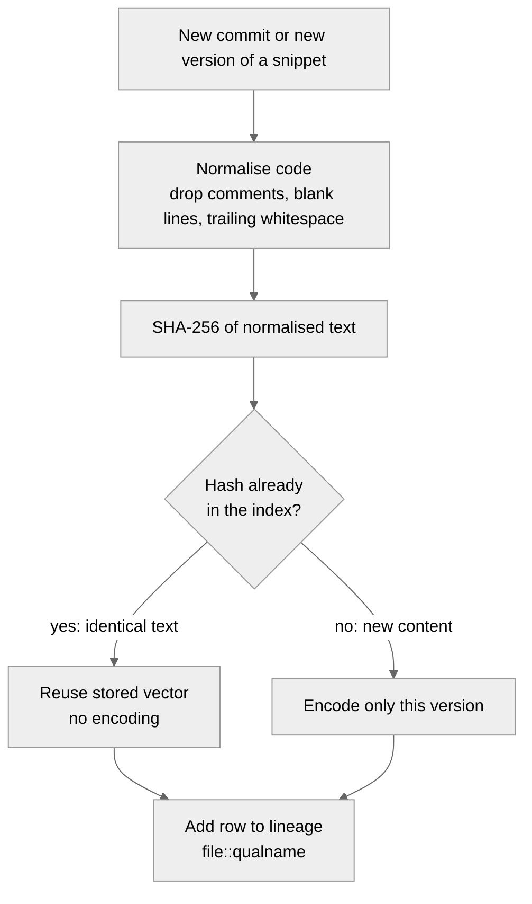
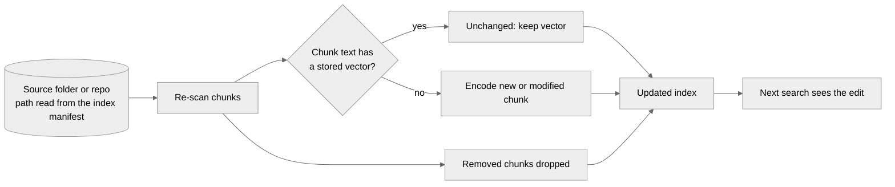
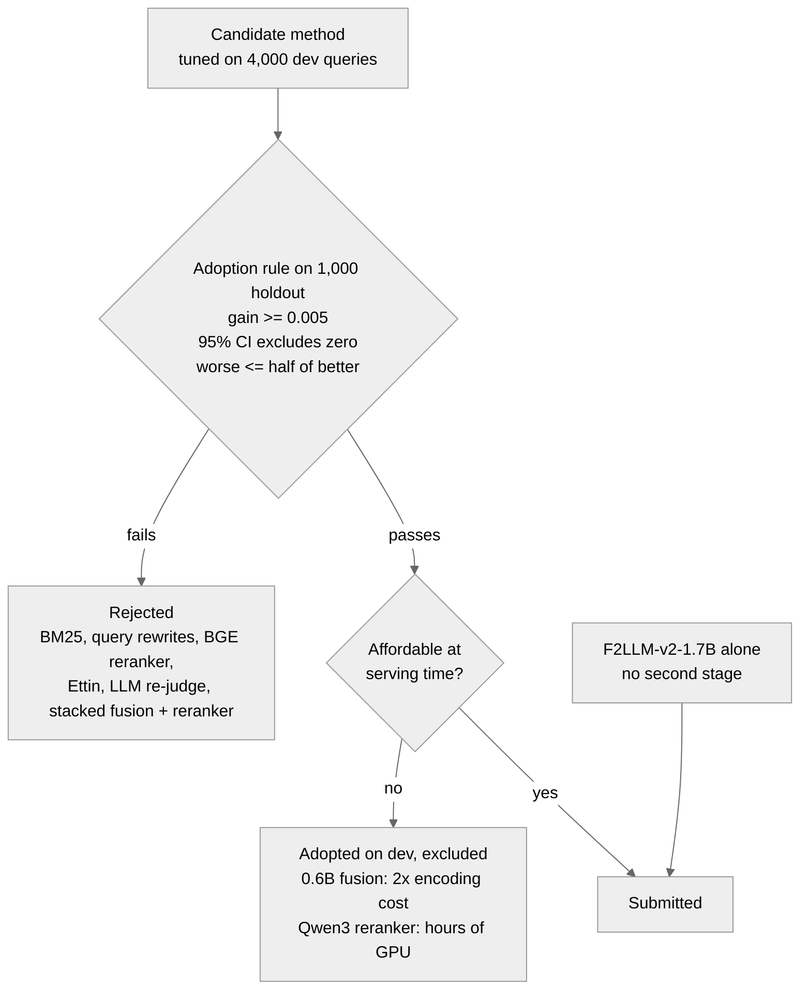

# Agentic Code Intelligence: code retrieval on CoIR-APPS

Samsung PRISM GenAI Hackathon, Theme 01.

A code retrieval system for the MTEB AppsRetrieval task (CoIR-Retrieval/apps): 3,765 test queries scored against the full 8,765-document corpus. The submitted model is F2LLM-v2-1.7B on its own. Around it sits a working tool: a CPU-only CLI, HTTP API and web UI that serve prebuilt indexes, exact-match lookup for pasted code, code-structure search, a retrieval agent, and incremental re-indexing across a repository's git history.

Demo video: https://drive.google.com/file/d/1wDjFpHr0uRhk8UyFnRUFN7JderoIUD-Y/view?usp=drive_link

## Headline result

NDCG@10 0.9376, MRR@10 0.9238 on the official test split.

| Metric | Value |
|---|---|
| NDCG@10 | 0.9376 |
| MRR@10 | 0.9238 |
| Recall@10 | 0.97955 |
| Recall@100 | 0.99655 |
| Published reference for the same model | 0.93692 / 0.92288 |

System: F2LLM-v2-1.7B alone, with no reranker, no fusion and no query cap. The 3,765 queries and 8,765 documents ran on a Kaggle T4 in 948 s (476 s document encoding, 462 s query encoding). These scores come from the evaluated run at commit `70518622e07b`; the release tag marks the final submission commit.

Matching the published reference to within 0.0007 confirms that the evaluation path, the prompt and the pooling are right. Differences measured between candidates are therefore real differences between candidates.

The lite variant (F2LLM-v2-0.6B) scores 0.9044 / 0.8840 on the same split and is about 2.5x faster on CPU. It is for interactive use; the submitted result is the 1.7B.

## Try it now: one-cell judge demo (Google Colab)

Open a new [Google Colab](https://colab.research.google.com/) notebook (a free CPU runtime is enough; serving needs no GPU), paste the cell below into one code cell and run it. It downloads the indexes and the lite model weights, starts the server, and prints a public link to the web UI.

Free Colab has about 12.7 GB of RAM. The cell serves the lite index (0.6B, about 4.5 GB RSS). The full index (1.7B) needs about 11 GB RSS, so use a runtime with more RAM if you select it.

```python
# ============================================================
# Samsung PRISM GenAI Hackathon - Theme 01 | Judge Demo
# ============================================================
import subprocess, time, re

# 1. Clone repo
subprocess.run("git clone https://github.com/dhruvvvgg/samsungprism-teamdiamonds-01.git", shell=True)
%cd samsungprism-teamdiamonds-01

# 2. Install serving deps (no CUDA, ~30s)
subprocess.run("pip install -q -r requirements-serve.txt --extra-index-url https://download.pytorch.org/whl/cpu", shell=True)

# 3. Download all indexes from the GitHub Release (full 1.7B, lite 0.6B, click git history)
subprocess.run("python scripts/fetch_release_assets.py --assets indexes", shell=True, check=True)

# Cache the lite neural weights before the fail-closed launcher checks them.
subprocess.run(["python", "-c", "from huggingface_hub import snapshot_download; import json; m=json.load(open('runtime_index_lite/manifest.json')); snapshot_download(m['model'], revision=m.get('revision'))"], check=True)

# 4. Start the API + Web UI server (lite fits free Colab RAM)
subprocess.Popen(
    ["python", "scripts/serve.py", "--index", "lite", "--host", "0.0.0.0", "--port", "8000"],
    stdout=open("/content/serve.log", "w"), stderr=subprocess.STDOUT
)
time.sleep(5)

# 5. Start Cloudflare tunnel
subprocess.run("wget -q https://github.com/cloudflare/cloudflared/releases/latest/download/cloudflared-linux-amd64 -O /content/cloudflared && chmod +x /content/cloudflared", shell=True)
subprocess.Popen("nohup /content/cloudflared tunnel --url http://localhost:8000 > /content/cf.log 2>&1 &", shell=True)

# 6. Wait for tunnel URL
for _ in range(30):
    time.sleep(2)
    try:
        m = re.search(r"https://[-a-z0-9]+\.trycloudflare\.com", open("/content/cf.log").read())
        if m:
            print(f"\n{'='*60}")
            print(f"  ✅ Web UI:   {m.group(0)}")
            print(f"  ✅ API docs: {m.group(0)}/docs")
            print(f"{'='*60}\n")
            break
    except FileNotFoundError:
        pass
else:
    print("❌ Tunnel URL not found. Check /content/cf.log")
```

Click the `Web UI` link that the cell prints.



**Open the link in Google Chrome.** The page is tested there. Browser extensions (ad and tracker blockers, privacy add-ons, VPN or proxy extensions, some security suites) can block requests to `*.trycloudflare.com` or the page's own calls to `/search`. The symptom is a blank page, a spinner that never ends, or "Failed to fetch". If that happens, open the link in an Incognito window (Chrome disables extensions there by default), or pause the extensions for the site and reload.

Why a tunnel: a Colab VM has no public address and cannot expose a port. The cell runs a Cloudflare quick tunnel (`cloudflared`), which needs no account and no token, and gives the server inside the VM a temporary public `https` URL. Nothing is installed on your machine.

What to expect:

- Memory: the server keeps one model in memory. The lite index fits free Colab. If startup fails, check `/content/serve.log`; `degraded` with "mock encoder in use" identifies an explicitly selected smoke-test encoder.
- First setup: the cell downloads the lite weights before startup, and the server loads them once and stays warm. Later short queries take about a second on the lite model; full APPS problem statements take a few seconds (see [Resources](#resources)).
- Switching index: the first search on a newly selected index includes its model load (see [What it does](#what-it-does)).
- The link is temporary: it changes every time the cell runs and stops working when the runtime stops or the cell is interrupted. Anyone holding the link can reach the demo while it runs, so stop the cell when you are done.
- The tunnel needs a few seconds: if the browser says the address cannot be resolved, wait about 30 seconds and refresh.
- Logs: `/content/serve.log` (server) and `/content/cf.log` (tunnel). The cell prints a pointer to `cf.log` if no URL appears within a minute.

More detail, including a troubleshooting table: `docs/COLAB.md`.

## What it does

Queries can be a plain-language description ("count the pairs whose sum is divisible by k"), a full APPS-style problem statement, or code. The UI, CLI and API share one search service, so a curl and a terminal return the same results.

Semantic search: the F2LLM encoder embeds the query and a cosine search returns the closest documents, so a description finds code that does the described thing without sharing its words. The vector search takes 4 to 6 ms; nearly all of the time is query encoding.

Exact match: a query that is already in the index comes back as an exact match. The service normalises the query and every indexed snippet (comments, blank lines, trailing whitespace and line endings are dropped; identifiers, literals and indentation are kept), compares SHA-256 hashes, and returns the matching document or documents with similarity 1.0 without encoding the query. The response sets `exact_match: true` and the UI shows an exact-match badge. Code that differs in any identifier or literal goes through the encoder and scores below 1.0. The official benchmark run does not use this path.

Indexes: the selector lists every index found on disk whose manifest loads. These are the lite index (0.6B, the default), the full index (1.7B, the submitted model) and the click git history index (0.6B, built for the version features). The server keeps one model in memory. Choosing another index releases the current model and loads the new one, which takes about 15 s for the 1.7B once its weights are on disk. If a load fails, the request returns an error and the server falls back to the lite index.

Structural questions: who calls a function, what it calls, and where a name is imported or used are answered from an AST index and a cross-file call graph. They need an index built from a source folder or repository, so they do not apply to the APPS indexes.

Agent: the `agent` checkbox runs a plan, search, read, refine loop of at most six steps and returns the full step trace. It needs no LLM and no API key. The planner is deterministic, and the optional LLM planner is off by default, goes through one provider-agnostic wrapper and defaults to a keyless mock.

Extras: the `extras` checkbox adds rule-based performance notes to each result. They need no model call.

In the web UI:

- Query box: multiline (Enter adds a line, Ctrl/Cmd+Enter searches), with five example queries.
- Results: each shows a similarity score, which is cosine similarity and useful only for ordering. It is never shown as a percentage or a confidence.
- Why this result: an expandable line with the query's route, the similarity gap to the next result, and the matched terms (query words that also appear among the snippet's identifiers, read from its AST). It is lexical and costs no model call. It does not explain why the embedding model scored a snippet as it did, and the UI says so. In the API, opt in with `"explain": true` on `POST /search`.
- Full snippet: clicking a result opens the whole document (`GET /doc?id=...`) with line numbers, a copy button and expand/collapse for long snippets. APPS documents show their document ID. A `file:start-end` location appears only for indexes that carry source-file metadata.
- Performance panel: query-encode, search and total time, device, model, query cap, whether the query was truncated, and the index's document count and size. Every figure comes from the response.
- Versions: on a versioned or git-history index, results are grouped by lineage (one entry per function, best version on top, other versions expandable). Each entry has a View history button that lists every version oldest first with its commit, and a compare panel shows two versions side by side with a per-result diff. Grouping is a view over the ranking, not a re-rank.
- Update index: shown only for indexes that have a source folder or repository (see [Incremental update](#incremental-update-of-a-served-index)).
- States: explicit loading, empty, unavailable-index and error states. Agent mode disables the version and category controls it ignores.
- Page: a single static page with no build step and no external dependency. The Python syntax highlighter is inline, so the page works offline, and a test asserts the served HTML contains no external URL.

Exact-query cache (serving only): an LRU cache lets a repeated identical query skip the encoder, and timings report `cached: true` or `false`. It holds 128 entries by default and is on in the API, the UI and the CLI's `--interactive` mode. `QUERY_CACHE=0` turns it off and `QUERY_CACHE_SIZE` sets the size. It is absent from the official run and every benchmark, and there is no fuzzy matching. In the final-run API smoke test a cache miss took 510 ms and a hit 0.02 ms on the lite index. The cache belongs to the loaded model, so switching index discards it.

## How it works



The indexes are built once and mounted read-only. Serving never touches the test split, and nearly all query latency is the encoder, not the search.

## Release assets

The GitHub Release for tag `PRISM_GENAI_HACKATHON_Y2026` (evaluated source commit `70518622e07b`) carries the official result and everything needed to check it:

| Asset | What it is |
|---|---|
| `appsretrieval_results.json` | MTEB's result JSON for the official run (screening artefact) |
| `appsretrieval_rankings.json` | ordered top-100 document ids per test query |
| `submission_checksums.json` | SHA-256 of the files above and of every index file |
| `runtime_index.zip` | prebuilt 1.7B index (the full index) |
| `runtime_index_lite.zip` | prebuilt 0.6B lite index (served by default) |
| `history_index.zip` | prebuilt git-history index (pallets/click, 40 commits, 0.6B) |
| `results_final.zip` | final-run result files and summaries |
| `run_logs.zip` | execution logs of the final run |

`appsretrieval_results.json` SHA-256: `1d323033cfea7a688cfcaf6e885d2a5703dc9ec7e5457ba53ebbbac04cfb41a7`
`appsretrieval_rankings.json` SHA-256: `41480c0168d9b018a24d1d308beff33cdf9ae1de053f318260679e43ebd2c9bf`

`python scripts/fetch_release_assets.py --assets indexes` downloads all three indexes; add `--index full`, `--index lite` or `--index history` to fetch one. See `docs/RELEASE_ASSETS.md` for the full list and verification steps.

## Quick start (CPU, local machine)

Needs Python 3.11+ and the prebuilt indexes. Download them from the release (`python scripts/fetch_release_assets.py --assets indexes`) or build one (see [Building an index](#building-an-index)).

```bash
git clone https://github.com/dhruvvvgg/samsungprism-teamdiamonds-01.git
cd samsungprism-teamdiamonds-01
pip install -r requirements-serve.txt --extra-index-url https://download.pytorch.org/whl/cpu
```

CLI, one question (`--index` picks the index by name: `lite`, `full` or `history`):

```bash
python src/cli.py "count the number of primes below n" -k 5
```

CLI, interactive (the model stays warm). This is the mode to demo, since the model load is paid once per process, not per query.

```bash
python src/cli.py --interactive
> count the primes below n
> :k 5
> :quit
```

API and web UI. The server serves the lite index unless `INDEX_DIR` names another one (for example `INDEX_DIR=full`).

```bash
uvicorn src.api:app --host 0.0.0.0 --port 8000
# then open http://localhost:8000/
curl localhost:8000/health
curl -s localhost:8000/search -H 'Content-Type: application/json' \
     -d '{"query": "binary search over a sorted array", "k": 5}'
```

`python scripts/serve.py --index lite --host 0.0.0.0 --port 8000`, used by the Colab cell above, starts the same app. `GET /health?index=NAME` reports on an index without loading it.

## Docker (CPU-only)

```bash
docker build -t apps-retrieval .
docker run --rm -p 8000:8000 -e INDEX_DIR=full -v "$PWD/runtime_index:/app/runtime_index:ro" apps-retrieval
# open http://localhost:8000/
```

One command: `docker compose up`

```bash
docker compose up --build        # then open http://localhost:8000/
```

`docker-compose.yml` builds the same CPU image, mounts `./runtime_index` read-only, serves the API and the web UI on port 8000, and caches the downloaded model in a named volume so a restart does not fetch it again. Choose another index or port with environment variables:

```bash
INDEX_HOST_DIR=./runtime_index_lite docker compose up --build   # the 0.6B lite index, ~4.5 GB RAM
PORT=9000 SEARCH_THREADS=2 docker compose up --build
```

If the mounted directory has no index, the container still starts and `GET /health` reports `degraded` with the reason. The first search downloads the model (network access required, once); everything after that is offline. The image builds in CI, but `docker compose up` itself has not been run end to end.

One-off CLI query instead of the server:

```bash
docker run --rm -v "$PWD/runtime_index:/app/runtime_index:ro" apps-retrieval \
    python src/cli.py "count the primes below n" -k 5
```

The index is mounted, not baked in. It is model output and changes independently of the code, and the image carries no CUDA libraries, no mteb and no datasets. Environment variables: `INDEX_DIR` (an index name or a path), `SEARCH_DEVICE`, `SEARCH_THREADS`, `CPU_DTYPE`, `MAX_QUERY_TOKENS`, `ALLOWED_INDEXES`.

`GET /health` reports what is loaded. The model loads at startup, so no user request pays for it. A load failure is recorded rather than raised, so the container reports `degraded` with the reason instead of exiting with a traceback.

## Reproducing the official result

Needs a GPU (a T4 is enough) and about 20 minutes.



```bash
pip install -r requirements.txt
python src/eval/run_official.py --config configs/official_f2llm17b_noreranker.json \
    --device cuda --confirm-test
```

One run produces everything, from the single encoding pass it already paid for:

| Output | What it is |
|---|---|
| `outputs/appsretrieval_results.json` | MTEB's own result dict (`task_result.to_dict()`) plus a `_run_info` block |
| `outputs/appsretrieval_rankings.json` | ordered top-100 document ids per test query |
| `outputs/submission_checksums.json` | SHA-256 of the files above and of every index file |
| `runtime_index/` | the served index: fp16 corpus embeddings, ids, texts, manifest |

The run is guarded. `--confirm-test` is required, a completed run writes a lock so the test split cannot be silently re-consumed, every write is atomic, and the lock is written last so a killed run leaves no state that looks finished. Each config states the score it expects, and the run warns if the gap exceeds ±0.004.

## Building an index

```bash
python src/build_index.py --preset f2llm-v2-1.7b --device cuda             # 572 s, 35.9 MB
python src/build_index.py --preset f2llm-v2-0.6b --device cuda --out lite  # 293 s, 18.0 MB
```

This reads the corpus through the dev loader (train qrels only), so the test split is untouched. An official run exports the same index for free.

## Resources

| | Value |
|---|---|
| Model | `codefuse-ai/F2LLM-v2-1.7B`, revision `3766d46e` |
| Parameters | 1.7 B (~3.4 GB in fp16) |
| Full test-split run, T4 | 948 s (476 s docs + 462 s queries) |
| Index build, T4 | 572 s → 35.9 MB (lite: 293 s → 18.0 MB) |

CPU serving, measured on 2 physical cores, fp32, uncapped:

| | 1.7B (full) | 0.6B (lite) |
|---|---|---|
| Official test NDCG@10 / MRR@10 | 0.9376 / 0.9238 | 0.9044 / 0.8840 |
| p50 latency | ~7.4 s | ~2.9 s |
| p95 latency | ~19 s | ~8.4 s |
| 1 thread, p50 | 13.6 s | 5.3 s |
| Peak RSS | 11.0 GB | 4.5 GB |
| Vector search itself | 4-6 ms | 4-6 ms |

Nearly all of the time is query encoding; retrieval is 4 to 6 ms. APPS queries are whole problem statements and attention cost grows faster than linearly in sequence length, so latency scales with query length, not with corpus size. Two cores against one is roughly 1.8x, so more cores is the one lever with no quality cost. The warm short-query figure is the one that matters for a live demo.

Serving query cap: 1024 tokens for the CLI, API and UI. It is the largest cap tested that was not significantly worse on dev (−0.0010 NDCG@10, 2.6% of queries truncated), and it bounds a very long tail. The official run is uncapped, and a test asserts it.

CPU precision: fp32 is the default. bf16 is available as a flag but is about 4x slower on the tested CPU, which has no native bf16, and the loader warns when that is the case. int8 dynamic quantisation is about 1.3x faster on the full model (p50 5.8 s against 7.5 s for fp32) but wrecks the embeddings: on 20 queries the cosine similarity to the fp32 embeddings was 0.068, the top-10 overlap was 0.01, and the top result changed on 19 of 20. int8 is rejected. It fails closed unless an explicit lossy-int8 flag is passed, and it is never recommended.

## P1: retrieval across versions

CoIR-APPS is a flat corpus with no history, so version-aware retrieval is built and tested two ways.

Every version of a snippet is keyed by the SHA-256 of its normalised code (comments, blank lines, trailing whitespace and line endings removed; indentation, identifiers, literals and operators kept). A rebuild re-embeds only the hashes it has not seen. This is exact reuse, not an approximation, since an identical hash means identical normalised text.



On the 40-commit click history this reused 95.4% of embeddings.

```bash
python src/build_version_index.py --device cuda   # synthetic fixture, ~500 snippets x 4 versions
python src/bench_versions.py --device cuda        # full vs incremental rebuild, per version

python src/build_history_index.py --device cuda --max-commits 40   # a real repo, commit by commit
python src/bench_real_history.py --device cuda --max-commits 40
```

The synthetic fixture has mutations known by construction (unchanged, rename, logic, add_lines, remove_lines), so its reuse rate has an exact right answer to check against. The benchmark fails if measured reuse falls below the fixture's own count of byte-identical versions.

The real-history path ingests a Python git repository commit by commit. The default is pallets/click: it is pure Python so every file parses with `ast`, its functions evolve, it is small enough to index a few hundred commits on a T4, and it is BSD-3-Clause licensed. A lineage is `file::qualname`, not a line range. Line numbers move on every edit above a function, so a line-based identity would report an unrelated edit as a full rebuild.

Version-targeted queries are generated with answers that do not come from the retriever: the text is the function's own docstring, and the discriminating token is an identifier the commit introduced, found by diffing identifier sets.

Measured so far (final-run smoke test, real encoder, 40-commit click history): 8,275 rows over 224 lineages, 379 distinct contents, 95.4% of embeddings reused, built in 74.6 s. A reindex of a small custom folder reused 19 embeddings and recomputed 1 in 0.473 s, with byte-identical vectors for the 19 reused. These are plumbing and reuse measurements, not retrieval-accuracy results.

Not yet measured: version-targeted retrieval accuracy (P1 top-1 version accuracy) and Bonus duplicate and lineage recall on a real encoder. No accuracy figure is claimed.

## Rename and move tracking

Implemented and unit-tested; not benchmarked. `python src/build_history_index.py --track-renames` (off by default; without it the output is unchanged) keeps a lineage across a renamed file or a renamed or moved function. Evidence is read within a single commit: git's own rename detection for files, and for functions the Jaccard similarity (default >= 0.8, `--rename-threshold`) of their normalised tokens, with the function's own name masked. The row after a link records `link_kind` (rename or move), `link_similarity` and `link_from`, and the ingest stats report how many links were made. Bodies under 8 tokens are never matched, and a copy that leaves the original in place is not a move. The threshold was chosen by reasoning, not tuned on data.

## Version-delta vectors (experiment)

Implemented and unit-tested; not benchmarked; off by default and not used by any served path. `src/versioning/delta_index.py` stores one base vector per lineage plus an int8 residual per distinct version, and searches in two stages (lineages by base vector, then their versions by reconstructed full vector). `python src/bench_real_history.py --delta-vectors` reports its index size and top-1 version accuracy against the current per-row vectors on the same queries. No size or accuracy figure is claimed. The storage saving depends on how many versions are unchanged, and the cost (int8 noise, and a lineage prefilter that can drop a lineage) has not been measured.

## Incremental update of a served index



A custom-folder or git-history index remembers its source, so it can be brought up to date without a rebuild:

```bash
python src/reindex.py --index my_code_index             # CLI
python src/reindex.py --index my_code_index --dry-run   # what would change; writes nothing
curl -s localhost:8000/reindex -H 'Content-Type: application/json' -d '{"index": "my_code_index"}'
```

The UI has an Update index button, shown only for indexes that have a source. The operation re-scans the source recorded in the index manifest and reports chunks added, modified, unchanged and removed, embeddings reused against recomputed, and the elapsed time. It encodes only chunks whose text has no stored vector; a test with a spy encoder shows that unchanged chunks are never re-encoded. The next search sees the edit. The official APPS indexes are refused (HTTP 400 in the final-run smoke test), the scan path comes from the manifest and never from a request, and API callers can only name indexes on an allowlist (`ALLOWED_INDEXES`: the named indexes and the server default). The one real-encoder measurement is the 19-reused, 1-recomputed, 0.473 s case above. It is a single small example, not a benchmark.

## Bonus: evolutionary retrieval

The versioned index holds every version at once, and which versions compete is decided per query:

```bash
python src/cli.py "sum the scores" --index versions                 # collapsed (default)
python src/cli.py "sum the scores" --index versions --all-versions  # every version competes
python src/cli.py "sum the scores" --index versions --version 2     # only version 2
python src/cli.py --history "src/click/core.py::Command.invoke" --index history
python src/bench_evolution.py --device cpu
```

By default each lineage collapses to its best-scoring version, so near-identical versions of one snippet stop sharing the top 10 between them and crowding other snippets out.

Compare two versions: `GET /compare?q=...&a=1&b=3` runs one query against two versions (encoding it once) and marks each result of B as appeared, moved (with the rank change) or same, and each result of A as disappeared or kept. "Appeared" means in B's top-k but not A's, not that it did not exist in A. `GET /diff?snippet_id=...&a=1&b=3` returns the unified diff (`difflib`) of one lineage between two versions. The UI has a compare panel with side-by-side results and a per-result diff. In the final-run smoke test, comparing v1 against v40 on the click history moved 2 results, kept 6 in the same position, and found 6 whose content changed. `/history/` and `/diff` were not exercised end to end on a real index, so treat them as unit-tested only.

Status: retrieval quality of evolutionary retrieval is not yet measured on a real encoder.

## Features, and how far each has been taken

"Benchmarked" means measured with a real model against a held-out set. "Smoke-tested" means it ran once end to end with a real encoder and behaved correctly, without a quality measurement. "Implemented and unit-tested" means it works and is covered by tests, but its quality has not been measured at scale.

| Feature | Status |
|---|---|
| Dense retrieval on CoIR-APPS (the submitted system) | Benchmarked: official test split, 0.9376 / 0.9238 |
| Lite 0.6B variant | Benchmarked: official test split, 0.9044 / 0.8840 |
| CPU serving: CLI, interactive mode, API, web UI | Benchmarked for latency and memory; API endpoints smoke-tested with a real encoder; UI functionally unit-tested |
| Serving query cap (1024 tokens) | Benchmarked on the dev slice (−0.0010 NDCG@10) |
| Failure analysis of the official test run | Measured: 77 of 3,765 queries (2.0%) miss the top 10 (56 other, 14 near-duplicate corpus entries, 7 generic wording); 13 fall outside the top 100 |
| Exact-match lookup (identical code returns similarity 1.0 without encoding) | Implemented; not benchmarked |
| Index selector across the lite, full and history indexes | Implemented; not benchmarked |
| Custom-folder indexing (any Python folder, function/class chunks with file:line) | Implemented and unit-tested; not benchmarked at scale |
| Query router (problem statement / intent / code / structural) | Implemented and unit-tested; not benchmarked at scale |
| Structural index, cross-file call graph, usage search | Smoke-tested (a `who_calls` query found 7 call sites); not benchmarked at scale |
| Retrieval agent (plan → search → read → refine, 6-step cap, full trace) | Smoke-tested (1 step, 7 answers); not benchmarked at scale |
| Snippet categories (AST family + labelled embedding clusters) | Implemented and unit-tested; not benchmarked at scale |
| Performance notes on surfaced code (the extras checkbox) | Implemented and unit-tested; not benchmarked at scale |
| Incremental "Update index" for folder and history indexes (`src/reindex.py`, `POST /reindex`, UI button) | Smoke-tested (19 reused, 1 recomputed, 0.473 s); not benchmarked |
| P1 incremental re-indexing (content hash) | Smoke-tested on a 40-commit click history (95.4% reuse, 74.6 s); accuracy not yet measured |
| Rename / move tracking in the git-history ingester (`--track-renames`, off by default) | Implemented and unit-tested; not benchmarked |
| Version-delta vectors: base vector per lineage + int8 residual per version (experiment, off by default) | Implemented and unit-tested; not benchmarked |
| Version comparison and lineage diff (`GET /compare`, `GET /diff`, UI panel) | `/compare` smoke-tested; `/diff` unit-tested only |
| Bonus evolutionary retrieval (lineage collapsing) | Implemented and unit-tested; accuracy not yet measured on a real encoder |
| int8 CPU quantisation | Measured and rejected: quality collapses (cosine 0.068 to fp32 on 20 queries); fails closed unless an explicit lossy flag is passed |

## Limitations

- Latency is dominated by query encoding, not retrieval. On two CPU cores a full APPS problem statement takes about 7.4 s with the 1.7B. A short question with a warm model takes about 1.05 s, and the lite model is about 2.5x faster throughout.
- Memory: the 1.7B needs about 11 GB RSS on CPU. A 12 GB machine, including free Colab, should serve the lite index. Selecting the full index there can exhaust memory and restart the runtime.
- Switching index reloads a model and discards the query cache.
- The Colab demo link is temporary. It depends on Cloudflare's free quick-tunnel service and on browser extensions not blocking it (see the demo section).
- Exact match covers code that is identical after normalisation. A snippet with a renamed variable goes through the encoder and scores below 1.0.
- Structural questions need an index built from a source folder or repository, and call-order queries ("which files call X before Y") are lexical, not an execution trace. Anything stronger would need control-flow analysis.
- Indexing and structural search cover Python only.
- The reranker and dense-dense fusion are implemented and measured but excluded from the submitted path for resource reasons (see [Experiments](#experiments-and-what-was-rejected)).
- P1 and Bonus retrieval accuracy is not yet measured with a real encoder, and neither are the four dev experiments (implemented, unit-tested, off by default). No accuracy figure for any of them is claimed.
- F2LLM-v2-4B does not fit a T4 (registry footprint 15.3 GB; out of memory even at batch size 1), so the accuracy available above 1.7B was not reachable on the hardware at hand.
- F2LLM reports declared training overlap with CoIR data. Dev-versus-test gaps (0.6B +0.0035, 1.7B −0.0034 against the published figures) show no sign of APPS-specific memorisation, but this cannot be ruled out from outside.
- A function that moves between files starts a new lineage in the version index by default. `--track-renames` joins renamed files and renamed or moved functions (implemented and unit-tested; not benchmarked).

## Experiments, and what was rejected

Every candidate was judged on a dev protocol built on the train split: a 4,000-query tune partition and a reserved 1,000-query holdout, against the same full 8,765-document corpus. No candidate below was judged on the test split. Adoption required all three of: NDCG@10 gain ≥ 0.005, a 95% paired-bootstrap CI excluding zero, and worsened queries ≤ half of improved.

| Direction | Dev-slice NDCG@10 | Outcome |
|---|---|---|
| F2LLM-v2-0.6B alone | 0.8959 | baseline |
| F2LLM-v2-1.7B alone | 0.9299 | submitted |
| 1.7B + 0.6B dense fusion | 0.9353 | passed adoption; excluded: doubles per-query encoding cost |
| 1.7B + Qwen3-Reranker-0.6B | 0.9371 | passed adoption; excluded: hours of GPU per run, plus per-query cross-encoder latency |
| Fusion + reranker stacked | 0.9404 | rejected: the 95% CI includes zero |
| BM25 hybrid | −0.004 to −0.21 | rejected: hurt at every setting |
| Query rewrites / instruction variants | below baseline | rejected: worst was −0.127 |
| BGE-reranker-v2-m3 | below baseline | rejected: hurt at every setting |
| Ettin rerankers (68M, 150M) | +0.0011 | rejected: not significant |
| LLM re-judge stage | n/a | rejected: recall@100 is 0.991, so the trigger almost never fires |
| F2LLM-v2-4B | n/a | rejected: out of memory on a T4 |
| int8 CPU quantisation (speed/quality, separate from the table above) | n/a | rejected: cosine 0.068 to fp32 |



The submitted system is a single model with no second stage. Fusion and reranking each passed adoption on dev but cost too much to run, and stacking them gave no significant gain.

Four further experiments are implemented, off by default and not evaluated: confidence-gated reranking (A), code-to-description fusion (F), LoRA fine-tuning of the lite model (B) and a category tiebreaker (E). Each has a dev script and would go through the same adoption rule. B has a paired evaluation stage that scores the base and tuned models on the same 1,000 holdout queries; it has not been run. No result is claimed for any of them.

The full write-up of the search is in `results/P0_summary.md`.

## Verifying this submission

```bash
# 1. recompute the headline metrics from the stored ranking, with an independent implementation
python src/verify_submission.py --confirm-test

# 2. see what the headline number hides: which queries miss the top 10, and why
python src/analyze_failures.py --confirm-test

# 3. collect every result file into one report
python src/build_metrics_report.py        # -> results/metrics.md

# 4. the test suite (fully mocked: no model, no dataset, no network)
pytest tests -q
flake8 src tests --max-line-length=110 \
    --extend-ignore=E501,W503,E226,E741,E402,E305,E306,E127,E128
```

`verify_submission.py` recomputes NDCG@10 and MRR@10 from the exported rankings with its own metric implementation and its own read of the qrels, then re-hashes every artefact against the recorded SHA-256. It loads no model. A disagreement points at one of three things: a wrong ranking export, a metric misunderstanding, or a file that changed after the run. It passed on the final run.

`build_metrics_report.py` tolerates missing inputs. Each one becomes a "not yet measured" row naming the command that would fill it. The test suite needs no model download, no dataset and no network access.

## Repository layout

```
src/retrieval      dense encoder, BM25, RRF + score-average fusion, rerankers, pipeline, query router
src/indexing       code chunking, structural index + call graph, categories, performance notes
src/versioning     content hashing, version fixture, git-history ingestion, versioned index
src/agent          provider-agnostic LLM wrapper, the optional re-judge stage, the retrieval agent
src/eval           dev protocol (dev_*.py), the official run, metrics, data loading
src/train          optional LoRA fine-tuning of the lite model
src/static         the single-page web UI
src/cli.py  src/api.py  src/build_index.py  src/search_service.py  src/runtime_index.py
src/verify_submission.py  src/analyze_failures.py  src/build_metrics_report.py
scripts            serve.py (API + UI), fetch_release_assets.py (release downloads)
configs            version-controlled official run configurations
docs               COLAB.md (judge demo details), RELEASE_ASSETS.md (release contents)
results            the P0 write-up, the dev runbook, benchmark outputs
tests              mocked unit tests and end-to-end smoke tests
```

Dependencies are split so a package nobody uses cannot break an install that does not need it:

| File | For |
|---|---|
| `requirements.txt` | evaluation, the dev protocol, the tests, CI |
| `requirements-serve.txt` | CPU serving and the Docker image: no mteb, no datasets, no CUDA |
| `requirements-experiments.txt` | optional: LoRA fine-tuning and local description generation (peft, accelerate) |
| `requirements-llm.txt` | optional: provider SDKs for the disabled LLM re-judge stage |

Every import of an optional package is function-local, so the code loads and the whole test suite passes without any of them installed.

Apache-2.0 license.
